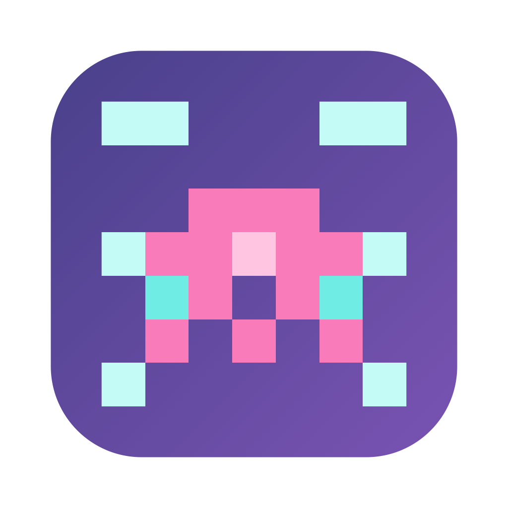
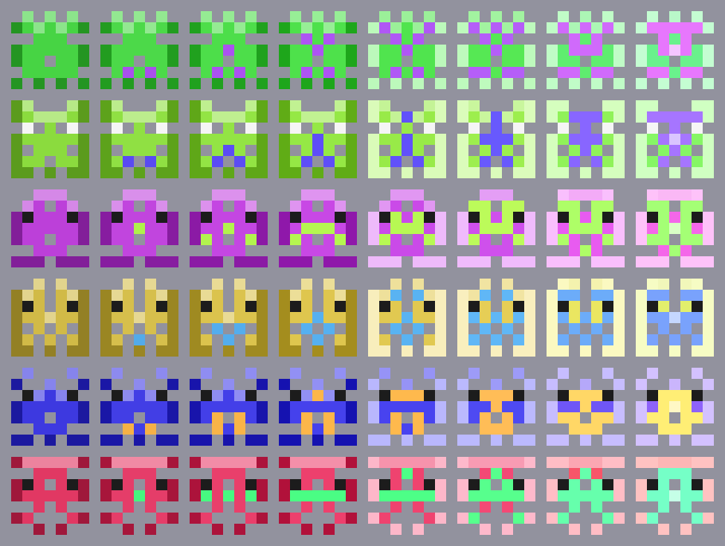
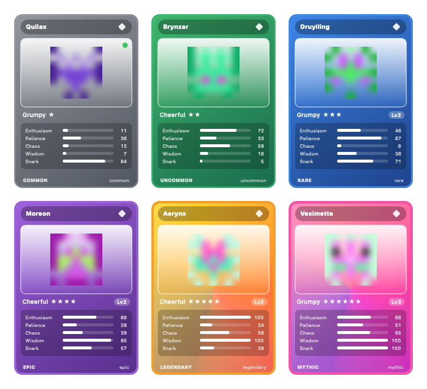
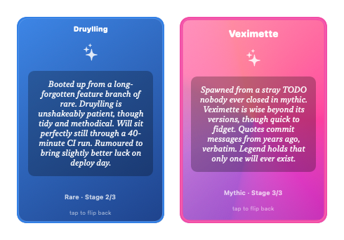

<div align="center">



# AIMon

**Pixel-art desktop companions for your Claude Code sessions.**

Every project you code in hatches its own little monster — an *aimon* — that lives on your screen,
watches you work, reacts to tests and errors, and grows a personality all its own. Collect them,
evolve them, and flip through them like trading cards.

</div>

---

AIMon is a tiny macOS menu-bar app. Open a [Claude Code](https://claude.com/claude-code) session in a
project and a monster appears for it; close the session and it wanders off. Each creature is unique
and deterministic — the same project always hatches the same aimon — with its own looks, name,
rarity, personality, and backstory.

## Features

- 🐣 **One creature per project**, deterministically generated from the project path — same folder,
  same aimon, forever.
- 💬 **It talks.** Reacts to sessions starting, tests running, and errors — offline with built-in
  lines, or richer and more in-character via a local LLM ([Ollama](https://ollama.com)).
- 🧬 **Personality drives everything.** Five traits (enthusiasm, patience, chaos, wisdom, snark),
  budgeted by rarity, shape what it says, *how often* it speaks, and how lively it moves.
- ✨ **Rarity & evolution.** Gacha rarities from Common to Mythic change its looks; it earns XP from
  real activity and evolves through three stages, sprouting new features and maturing its traits.
- 🃏 **The Aidex** — a gallery of collectible trading cards (one per aimon) styled by rarity, that
  flip in 3D to reveal each creature's backstory.
- 🖱️ **Hands-on.** Drag to move, scroll to resize, single-click to re-hear its last line,
  double-click to jump to its terminal.

## Screenshots

**Rarity ladder & evolution** — the same creatures from Common → Mythic, then evolving (horns, gems, foil):



**The Aidex** — collectible cards, themed by rarity, that flip to show a backstory:




## Requirements

- macOS 13 (Ventura) or later
- [Claude Code](https://claude.com/claude-code) — aimons appear for its live sessions
- *(optional)* [Ollama](https://ollama.com) for AI-generated speech (falls back to built-in lines without it)

## Install

**From a release:** grab the latest `AIMon-x.y.z.dmg` from the
[Releases](https://github.com/chvanikoff/aimons/releases) page, open it, and drag **AIMon** to
Applications. The build is ad-hoc signed, so the first time you open it macOS will say it's from an
unidentified developer — **right-click the app → Open → Open** (once).

**From source:**

```sh
git clone https://github.com/chvanikoff/aimons.git
cd aimons
swift run AIMon          # run it
# or build a distributable .dmg:
./scripts/package-dmg.sh
```

AIMon runs as a menu-bar agent (the 👾 icon) — there's no dock icon or main window.

## Speech (optional, via Ollama)

Without Ollama, aimons speak using built-in template lines that cover every situation. For richer,
in-character chatter, install [Ollama](https://ollama.com) and pull a small model:

```sh
ollama pull llama3.2:3b   # great on 16GB Macs; AIMon recommends a model for your RAM
```

On launch, if Ollama is running but has no suitable model, AIMon offers to download the recommended
one. You can toggle Ollama, pick a model, and download from **👾 → Settings…**.

## How it works

See **[docs/GAME-MECHANICS.md](docs/GAME-MECHANICS.md)** for the full breakdown — rarity odds, the
trait-point budget, XP and evolution thresholds, the tiered speech engine, and more.

In short: a project's path is hashed to a seed; the seed deterministically produces the creature's
appearance, name, rarity, and personality. A poller watches for live `claude` processes and shows one
monster per project directory. Speech is tiered — an always-available template floor, upgraded to a
local LLM line if one answers within a short deadline.

## Development

The code splits into two targets:

- **`AIMonCore`** — pure, dependency-light logic (identity, rarity, personality, evolution, speech
  templates, the session-watch engine). Fully unit-tested.
- **`AIMon`** — the macOS app (AppKit windows, SpriteKit animation, SwiftUI for the Aidex/Settings,
  process probing, Ollama I/O).

```sh
swift test                       # 148 unit tests
swift build                      # debug build
./scripts/package-dmg.sh         # release .app + .dmg
```

A few hidden dev flags render art/identities headlessly (used by the packager and for eyeballing):
`--render-test`, `--stable-test`, `--identity-test`, `--app-icon <png>`.

## License

[MIT](LICENSE) © Roman Chvanikov
